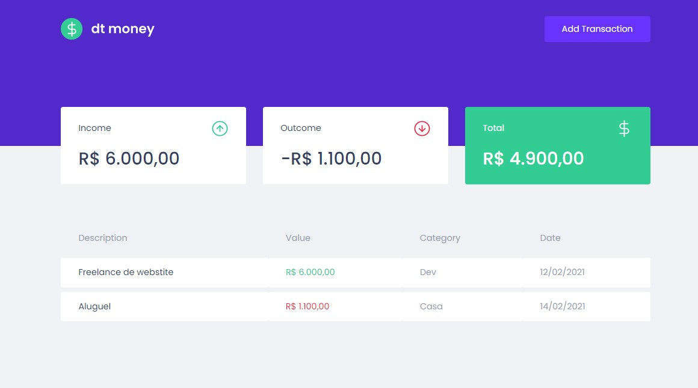
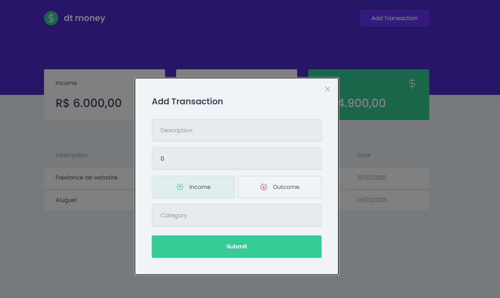

<h1 align="center">
  
</h1>

<p align="center">
  
  
</p>


## 🧪 Technologies

Project developed with the following technologies:

- [ReactJS](https://reactjs.org/)
- [TypeScript](https://www.typescriptlang.org/)
- [Styled Components](https://styled-components.com/)
- [Mirage JS](https://miragejs.com/)
- [Axios](https://axios-http.com/)
- [Polished](https://polished.js.org/)

## 🚀 How to run the project

Clone the project and access its folder.

```bash
$ git clone https://github.com/felipekejo/dtmoney.git
$ cd dtmoney
```

To start it, follow the steps below:
```bash
# Install all the dependencies
$ yarn
# Start the project
$ yarn start
```
The app will be available in your browser by address http://localhost:3000.

## 💻 Project

Dtmoney is a financial control application. It was developed during the classes in Chapter II of the RocketSeat's Bootcamp Ignite ReactJS track, and it is possible to register and delete transactions and see the income and outcome of the balance. 💰

## 🔖 Layout

You can view the project layout through the link below:

- [Layout Web](https://www.figma.com/file/0xmu9mj2TJYoIOubBFWsk5/dtmoney-Ignite-(Copy)?node-id=0%3A1)


## 📝 License

This project is under the MIT license. See the [LICENSE](LICENSE.md) file for more details.
